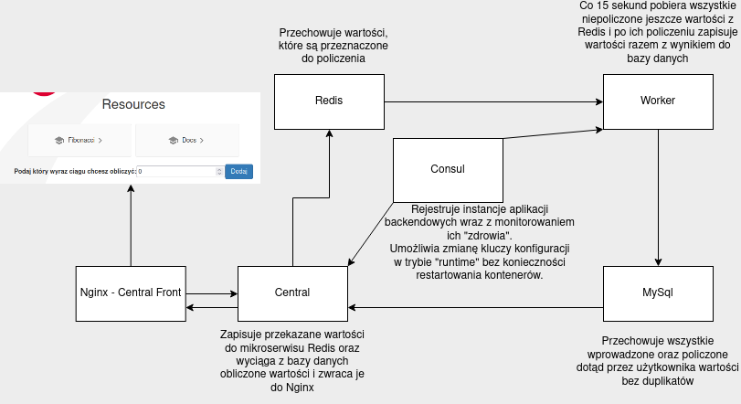
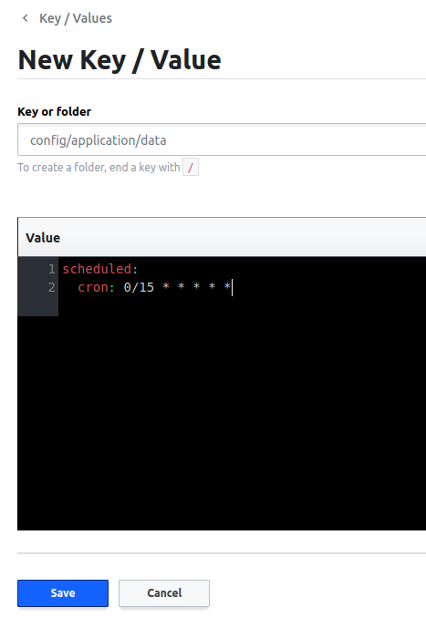
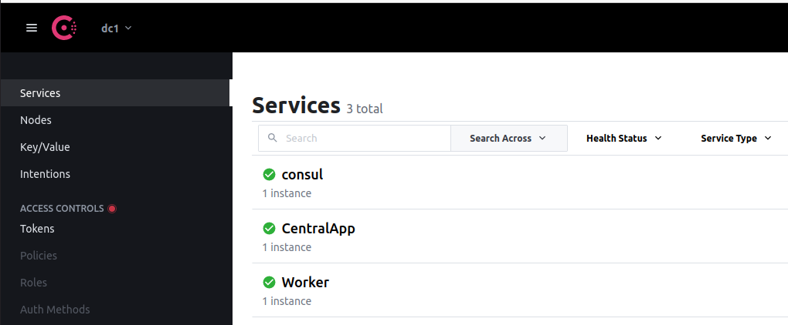

## Uruchomienie

W katalogu głównym wykonać polecenie: docker-compose up -d

Podczas pierwszego uruchomienia należy poczekać około 10 min. Kontener central oraz worker będzie się restartował do momentu
pełnego załadowania się kontenera bazy danych. Kontener CentralFront i jego dependency ładuje się również około 10 min.

Następnie przechodzimy pod adres: [FrontApplication](http://localhost:4200/)

## Schemat działania aplikacji

Aplikacja umożliwia wprowadzenie wartości n przez użytkownika, której zatwierdzenie spowoduje obliczenie n-tego wyrazu
ciągu Fibonacciego. Wartość wysyłana jest do serwisu Central, który zapisuje ją w serwisie Redis. Zapisane zostaną tylko
wartości, które nie zostały już wcześniej obliczone.(Możemy zapisać dowolną liczbę wartości. Następnie worker wczytuje
co 15 sekund wszystkie nieprzetworzone wartości z serwisu Redis, obliczy wartości oraz odpowiednio zapisuje je do bazy
danych. Aplikacja Central umożliwia odczyt tych wartości z bazy danych. Aplikacja frontendowa co 10 sekund pobiera z
serwisu Central policzone wartości dla podanych wyrazów ciągu.

## Zmiana konfiguracji i discovery client

### Consul znajduje się pod adresem: [Consul](http://localhost:8500/) (po uruchomieniu na środowisku lokalnym)

Możemy zmieniać konfigurację aplikacji w trybie runtime. Możemy zmienić częstotliwość procesowania danych przez worker
tworząc w zakładce Key/Values katalog tak jak na rysunnku poniżej.(Ważna jest nazwa katalogu "config/application/data").
Następnie pod kluczem scheduled.cron możemy zdefiniować nowy cron, który zmieni czas co jaki włącza się procesowanie.

Funkcja discovery client pozwala na monitoring aplikacji. Aplikacje podczas startu rejestrują swoją instancję i dzięki
wystawionemu w nich API consul monitoruje ich stan. 

